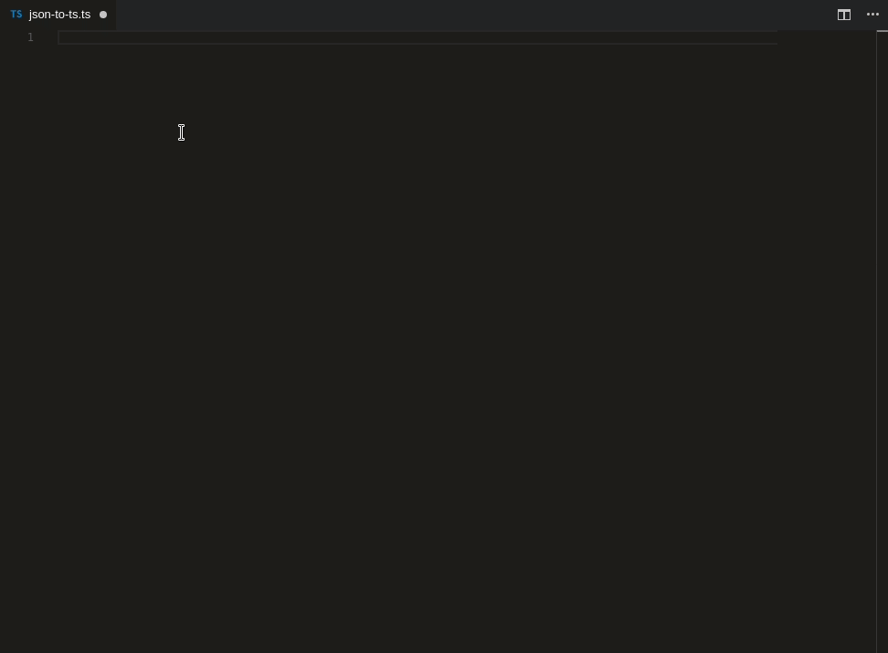
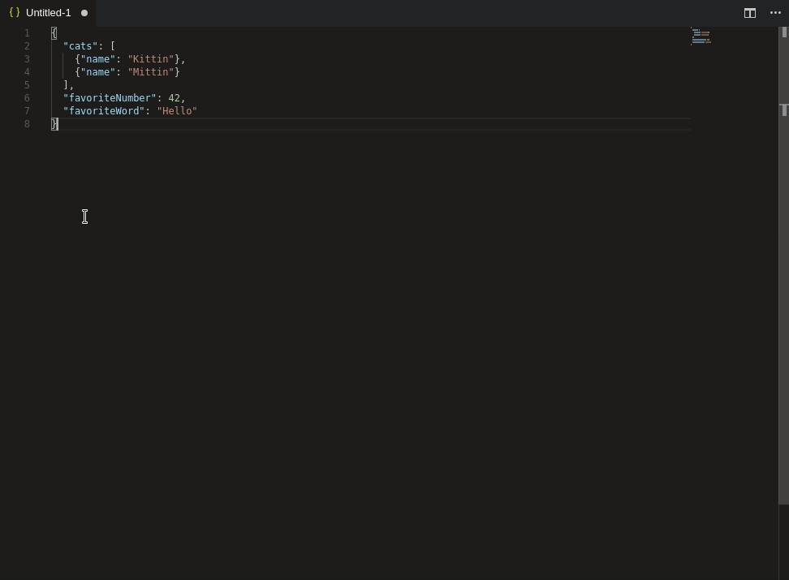
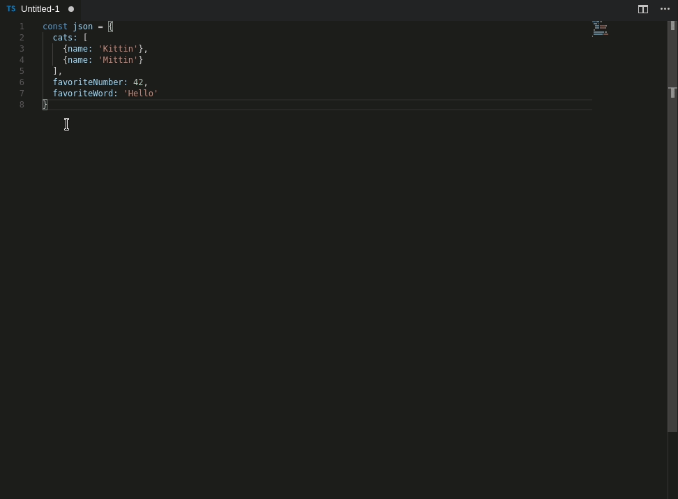

# JSON to TS 

### Convert JSON object to typescript interfaces
### [Try it Online](http://www.jsontots.com)

## Features

#### Convert from clipboard (`Ctrl + Alt + V`)


#### Convert from selection (`Ctrl + Alt + S`)


#### Optional quotes


### [Image](https://ibb.co/fwnoYF) comparison to similar extension "json2ts" (0.0.6) 

## Converter
- Array type merging (**Huge deal**)
- Duplicate type prevention
- Union types
- Optional types
- Array types

## Installation
```
ext install json-to-ts
```

## Known Issues
`Command failed: xclip -selection clipboard -o`

---
Solution: `sudo apt-get install xclip`

Happens when linux is missing clipboard packages

## Links
- [Repo](https://github.com/MariusAlch/vscode-json-to-ts)
- [Issues](https://github.com/MariusAlch/vscode-json-to-ts/issues)
- [Change log](https://github.com/MariusAlch/vscode-json-to-ts/blob/master/CHANGELOG.md)
